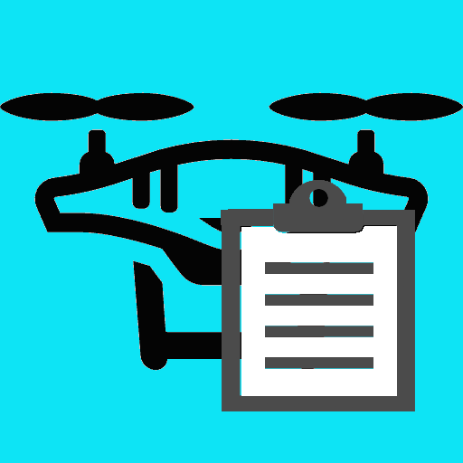
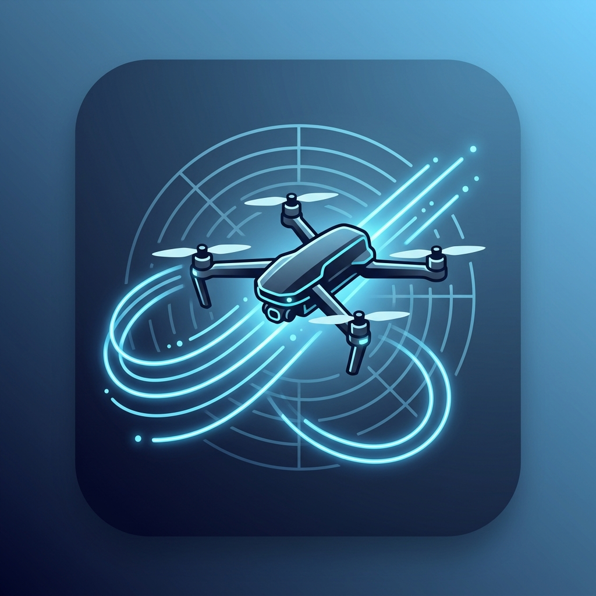
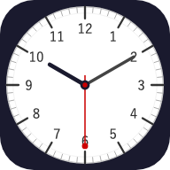

# 自分用に作ったアプリを公開しています

PWAアプリは基本的にはブラウザーアプリで動作しますが、最初に開いた時に自分のローカルPC（MacやWindows）にインストールすることで、アプリのように単体で起動して利用することができるようになります。

## DJI 製ドローンの飛行記録作成に便利なアプリ

### DJI飛行ログファイルの解析アプリ for  DJI Flight Log Viewer

・DJI Fly の Flight Log ファイルを DJI Flight Log Viewer サイトで CSV.zip にしたログファイルを解析して、飛行記録に必要な情報を取り出す PWA アプリ

 　[DJI 飛行ログ解析アプリ for csv.zip へのリンク](./DJIlog/PWA/)
  
### DJI飛行ログファイルの解析アプリ for  Open DroneLog CSV

・DJI Fly の Flight Log ファイルを Open DroneLog アプリで CSV でエクスポートしたログファイルを解析して、飛行記録に必要な情報を取り出す PWA アプリ

 　[DJI 飛行ログ解析アプリ for CSV へのリンク](./OpenDroneLog-CSV/PWA/)

### DJI飛行ログファイルの解析アプリ for  Open DroneLog CSV V.2 (Google AI Studio版）

・DJI Fly の Flight Log ファイルを Open DroneLog アプリで CSV でエクスポートしたログファイルを解析して、飛行記録に必要な情報を取り出す PWA アプリ

Google AI Studio版

 　[DJI 飛行ログ解析アプリ for CSV へのリンク](./DroneLog-CSV/PWA/)

### 飛行メモアプリ

 ・ドローンを飛行させた際に離着陸の時刻を現場でメモするための PWA アプリ
 
 スマホなどにインストールしておけば離陸時・着陸時にボタンを押すだけで時刻を記録できます。

　[飛行メモアプリへのリンク](./DroneMemo/PWA/)
 

## その他便利なアプリ

### BASE64 エンコード／デコード

 ・BASE64 でエンコード、デコードをする PWA アプリです。

  [BASE64エンコード／デコードアプリへのリンク](./BASE64/PWA/)

### AnalogClock

  ・アナログ時計を表示する PWA アプリです。
   
   アプリとしてインストールすることで、デスクトップ時計のように利用できます。
   
   アプリのインストールが禁止されている環境でも Web アプリならインストールできる可能性があります。

   [アナログ時計へのリンク](./AnalogClock/PWA/)
   
 
## 後は未定
